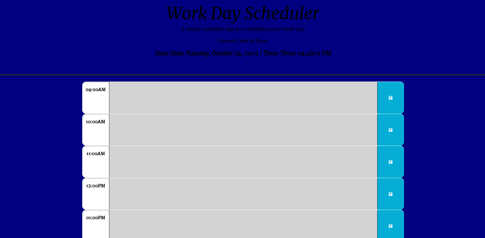

# Online Workday Scheduler

## Description

Challenge Module 05 Third Party API's - This challenge was a mind breaker trying to figure how to make it everything work how it supposed to but at the end seeing my work done is the best feeling ever; here I created a work scheduler which is actually useful to plan your day of work with a list of TODO's.

## Usage

The page will display the current time and day and the 8 hours of work for that day, all you need to do is type the TODO's for that hour right in the box of the hour and click the save button at the right hand side that way if the page is closed or reload by mistake your TODO's are still saved and showing. The hours that are in color gray means that they already passed, the hour in color red is the current hour and the hours in color green are the future hours coming up.

## Screenshot & Live Link

Live Link: https://torresbones.github.io/workdayscheduler/

## License

MIT License

Copyright (c) 2023 Jonathan Torres Bones

Permission is hereby granted, free of charge, to any person obtaining a copy
of this software and associated documentation files (the "Software"), to deal
in the Software without restriction, including without limitation the rights
to use, copy, modify, merge, publish, distribute, sublicense, and/or sell
copies of the Software, and to permit persons to whom the Software is
furnished to do so, subject to the following conditions:

The above copyright notice and this permission notice shall be included in all
copies or substantial portions of the Software.

THE SOFTWARE IS PROVIDED "AS IS", WITHOUT WARRANTY OF ANY KIND, EXPRESS OR
IMPLIED, INCLUDING BUT NOT LIMITED TO THE WARRANTIES OF MERCHANTABILITY,
FITNESS FOR A PARTICULAR PURPOSE AND NONINFRINGEMENT. IN NO EVENT SHALL THE
AUTHORS OR COPYRIGHT HOLDERS BE LIABLE FOR ANY CLAIM, DAMAGES OR OTHER
LIABILITY, WHETHER IN AN ACTION OF CONTRACT, TORT OR OTHERWISE, ARISING FROM,
OUT OF OR IN CONNECTION WITH THE SOFTWARE OR THE USE OR OTHER DEALINGS IN THE
SOFTWARE.
